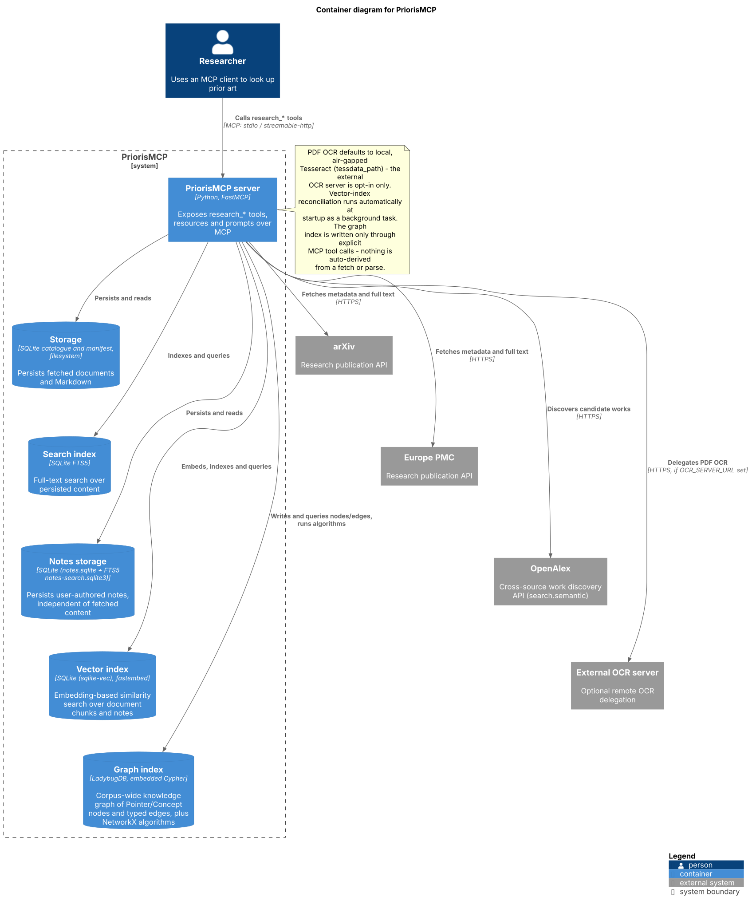

# PriorisMCP

A [Model Context Protocol](https://modelcontextprotocol.io) (MCP) server to facilitate looking up prior art.

PriorisMCP gives an MCP client a single, uniform way to search, fetch, and parse prior art from research-publication sources — arXiv and Europe PMC in v1, with patents and other prior-art domains anticipated as future work. See the [Software Requirements Specification](requirement-specification/index.md) for the full design.

As explained in the C4 container diagram below, a researcher's MCP client (e.g., Claude Code) talks to the PriorisMCP server over MCP; the server fetches metadata and full text from arXiv and Europe PMC, optionally delegates PDF OCR to an external server, and persists what it fetches to a local SQLite catalogue and full-text search index.

## Next steps

- [Getting started](01-getting-started.md) — install PriorisMCP and connect it to Claude.
- [Configuration](02-configuration.md) — environment variables recognised by the server.
- [Tools](03-tools.md) — the MCP tools exposed by the server.
- [Resources](04-resources.md) — the MCP resource templates exposed by the server.
